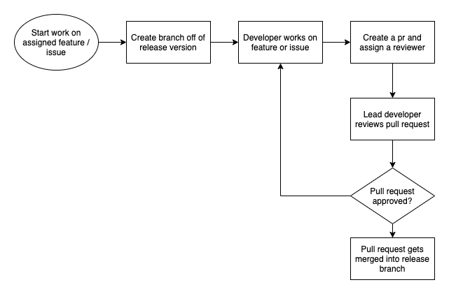

# Africa Global Radio Code Style Guide

## Git
- One commit, one purpose
- Commit messages should be short (<40 chars) and succinct
- Commit messages should be in the imperative : `Fix promise rejection in save()`
- Use semantic commit messages [semantic commit](https://gist.github.com/joshbuchea/6f47e86d2510bce28f8e7f42ae84c716)

## Github Flow
- Plan release and features ahead
- Always use a topic branch off of the release branch `git checkout -b feat/add-home-page`
- Commit your work on that topic branch
- Once complete rebase and make a pr to the next release branch
- Only the Lead developer or the reviewer of the pr should be able to merge

